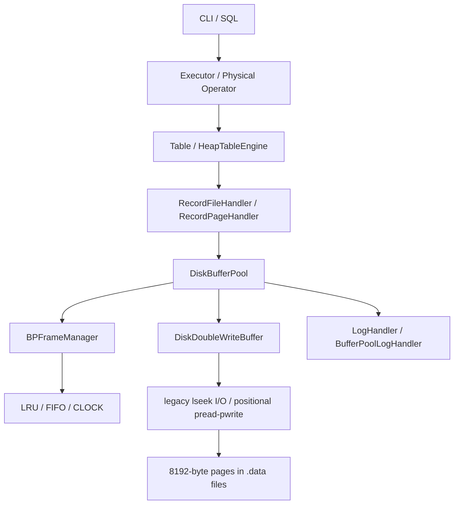

# 操作系统 / 存储系统最终验收总结

> 审计日期：2026-09-14；范围：`src/observer/storage/os` 及其真实上、下游。结论基于源码调用链、当前 Git 历史、已有测试的实际运行、一次隔离数据目录上的 SQL 写入/关闭/重启/查询。未以 README 或文件名代替实现证据。

## 1. 模块定位

OS/Storage 模块把数据库的记录访问转换为固定大小页面访问，负责页面分配/回收、内存 Frame、pin/unpin、dirty 回写、替换、文件 I/O、双写保护、WAL 配合和运行统计。SQL Parser/Optimizer 不属于本报告；仅在证明入口链路时提及。

主实现位于 `src/observer/storage/os/`。`src/common/os/` 是进程、信号、路径等通用 OS 封装，并非课程页式存储主体。上层 Heap 表通过 `storage/record` 使用本模块，当前产品存储引擎统一为 Heap，不存在绕过 Buffer Pool 的第二条数据路径。

## 2. 系统架构



初始化：`main` 解析 `--buffer-size/--replacement/--io-backend/--durable` → `init` → `Db::init` 创建 `BufferPoolManager`、双写文件和日志处理器 → 打开 catalog/table 数据文件 → `DiskBufferPool::open_file` 将 header page 常驻并 pin。恢复顺序包含 double-write `recover()` 与日志 `replay()`。

正常读：Record Handler → `get_this_page`；命中则更新策略并 pin，未命中则申请 Frame，必要时选 victim，脏 victim 先 flush，再从双写缓存或数据文件读页。正常写是修改 Frame 后 `mark_dirty()`，随后 eviction、显式 flush 或关闭过程写回。

关闭：表/DB 析构 → `DiskBufferPool::close_file` → header unpin → `purge_all_pages(SHUTDOWN)` → 清空双写页 → close fd。`purge_all_pages` 现在聚合并返回首个 flush/purge 错误，失败时不会继续清空 double-write 或关闭文件。

## 3. 核心目录与代码

| 模块 | 文件 | 核心类/函数 | 作用 |
|---|---|---|---|
| Page | `src/observer/storage/os/page/page.h` | `Page`, `BP_PAGE_SIZE` | 8192 字节物理页：LSN、checksum、data |
| Frame | `src/observer/storage/os/page/frame.{h,cpp}` | `Frame`, `FrameId` | 页帧、dirty、原子 pin count、读写 latch |
| Buffer | `src/observer/storage/os/buffer/disk_buffer_pool.{h,cpp}` | `BPFrameManager`, `DiskBufferPool`, `BufferPoolManager` | Frame 容量、页分配、读写、淘汰、flush、文件生命周期 |
| Replacement | `src/observer/storage/os/replacement/replacement_policy.{h,cpp}` | `LRUReplacementPolicy`, `FIFOReplacementPolicy`, `ClockReplacementPolicy` | 可配置 victim 策略 |
| I/O | `src/observer/storage/os/io/page_io_backend.cpp` | `LegacySeekPageIOBackend`, `PositionalPageIOBackend` | 完整页 read/write、fsync；positional 避免共享文件偏移 |
| Reliability | `src/observer/storage/os/buffer/double_write_buffer.{h,cpp}` | `DiskDoubleWriteBuffer` | 目标数据页前的双写暂存与恢复 |
| WAL glue | `src/observer/storage/os/diagnostics/buffer_pool_log.{h,cpp}` | `BufferPoolLogHandler` | allocate/deallocate WAL 及 redo |
| Diagnostics | `src/observer/storage/os/diagnostics/*` | `BufferPoolStats`, `snapshot` | hit/miss、I/O、eviction、pin、dirty、延迟、trace |
| Record integration | `src/observer/storage/record/record_manager.cpp` | `RecordPageHandler`, `RecordFileHandler` | 将 record 操作映射为 page 操作 |
| Table integration | `src/observer/storage/table/heap_table_engine.cpp` | `HeapTableEngine::init` | 从 Db 打开 `.data` Buffer Pool |
| DB lifecycle | `src/observer/storage/db/db.cpp` | `Db::init`, `Db::recover` | 创建管理器、双写/WAL、恢复 |

关键数据结构：页 0 的 `BPFileHeader` 保存 `buffer_pool_id/page_count/allocated_pages/bitmap`；`BPFrameManager` 用哈希 LRU 容器定位 Frame、内存池限制容量、独立 ReplacementPolicy 保存顺序/时钟元数据；Frame 用 `(buffer_pool_id,page_num)` 唯一定位。

## 4. 页式存储管理

- Page：`Page` 恰为 8192 字节，数据区为 `8192-sizeof(LSN)-sizeof(CheckSum)`；物理 offset 为 `page_num * 8192`。这是原始内存布局直接持久化，没有跨版本/跨端序格式层。
- Page ID：文件内 `PageNum` 连续增长；页 0 是 header。文件级 `buffer_pool_id` 与 page num 组成全局 FrameId。创建/打开文件会用原子 `next_buffer_pool_id_` 避免运行期冲突。
- allocate：优先线性扫描 bitmap 复用空洞；否则扩展 `page_count` 并写零页。最大页数受单一 header bitmap 限制，约 65K 页。
- free：`dispose_page` 清 bitmap 并减少 allocated count；被业务 pin 的页拒绝释放。页 0 不可释放。
- read：语义上的 `get_page()` 是 `DiskBufferPool::get_this_page(PageNum, Frame **)`；缓存 miss 后 `load_page` 从 double-write 或 PageIOBackend 读取。
- write：上层修改 `Frame::data/page` 并 `mark_dirty`；语义上的 `write_page()` 包含 `flush_page`（Buffer→double-write）与公开的物理 `write_page(PageNum,Page&)`（double-write→目标文件）。
- persistence：dirty 页在 flush/eviction/close 时写回；审计 SQL 在正常关闭并重启后读回同一值。
- checksum：flush 对 data 计算 CRC32；double-write 恢复装载时检查。普通数据文件读取路径未验证 checksum，故不能宣传为全面 page validation。
- recovery：双写测试覆盖正常/模拟异常副本恢复；日志支持页面 allocate/deallocate redo，并由 `IntegratedLogReplayer` 驱动。代码明确没有 undo，不能声称完整 ARIES 或未提交事务回滚。

边界结论：文件不存在返回 `IOERR_ACCESS`；短读/短写通过 `readn/writen/preadn/pwriten` 循环与 RC 传播处理。`get_this_page` 在乐观查找前和取得文件锁后均调用 `check_page_num`，拒绝负数、越界和已释放页；`dispose_page` 在修改 bitmap/计数前执行同一校验，因此重复释放返回 `BUFFERPOOL_INVALID_PAGE_NUM`。释放页重新分配后会清零完整 Page、设置新 LSN 并标脏，测试确认旧 payload 不可见。

### 页面测试矩阵

| Test ID | 目的/输入 | 预期 | 实际结果 | 判定 | 证据 |
|---|---|---|---|---|---|
| OS-PAGE-01 | 分配 100+100 页 | 唯一有效页号 | 成功 | PASS | `disk_buffer_pool_test: allocate_dispose` 运行通过 |
| OS-PAGE-02 | 写 record/page payload | dirty 后可落盘 | 成功 | PASS | `RecordManager.durability` 与 SQL 写入 |
| OS-PAGE-03 | 读取已分配页 | 内容一致 | 成功 | PASS | durability + SQL SELECT |
| OS-PAGE-04 | 释放 50 页 | bitmap/count 更新 | 成功 | PASS | `allocate_dispose` |
| OS-PAGE-05 | 再分配空洞 | page id 复用且旧内容清零 | 原 page id 被复用，整页内容清零 | PASS | `BufferPoolOS.rejects_invalid_pages_and_clears_reused_page` |
| OS-PAGE-06 | 多页分配/扫描 | 数量与内容一致 | 200 页流程通过 | PASS | `allocate_dispose`, RecordScanner |
| OS-PAGE-07 | 关闭重启 | 原数据可读 | SQL 值 `7/page-survives` 可读 | PASS | 本次 E2E；`RecordManager.durability` |
| OS-PAGE-08 | 非法/释放后 page id | 明确拒绝 | 负数、越界、bitmap 未分配及重复释放均返回非法页号 | PASS | `BufferPoolOS.rejects_invalid_pages_and_clears_reused_page`；`get_this_page`/`dispose_page` |
| OS-PAGE-09 | 文件缺失、满缓存、短 I/O | 返回 RC，不挂死 | 文件/满缓存和 helper 有处理；缺 fault injection | PARTIAL | `open_file`, `returns_no_buffer...`, `common/io/io.cpp` |
| OS-PAGE-10 | 异常恢复 | double-write + redo 恢复 | 模拟异常测试通过；无 undo/断电注入 | PARTIAL | `DoubleWriteBuffer.single_file_exception` |

页式存储评分：**3.8/4，PASS**。正向流程、非法 ID、重复释放和复用清零均有回归测试；完整 undo 与真实断电 fault injection 仍未覆盖。

## 5. Buffer Pool 与缓存替换

容量由 byte size 除以 8192 得到，最少一帧；页 0 常驻会消耗容量。查找由 FrameId 哈希映射完成。命中调用 `on_access` 并 pin；miss 申请内存池 Frame。池满时 `choose_victim(is_replaceable)` 只允许 `pin_count==0`，没有 victim 时返回 `BUFFERPOOL_NOBUF`，不会死循环。

LRU 用 list + positions map，访问时 splice 到队尾；FIFO 不因访问改变次序；CLOCK 使用环、hand 和 reference bit。固定序列容量 3：A,B,C,A 后淘汰一个 Frame，实测 LRU victim=B，FIFO=A，CLOCK=A。该测试观察了真实 victim，不只是最终业务返回值。

dirty victim 在 free 前调用对应 DiskBufferPool 的 `flush_page_internal(EVICTION)`；clean victim 不写回。`flush_page` 计算 CRC并进入 double-write；`flush_all_pages` 刷全部 Frame；`flush_dirty_pages` 可限制数量并跳过业务 pinned 页。Frame pin count 是原子，page latch 是递归共享锁；Frame Manager 和每个 DiskBufferPool 有 mutex。并发粒度较粗，且 replacement policy 自身依赖 Frame Manager 锁保护。

| Test ID | 输入/观察点 | 实际结果 | 判定 |
|---|---|---|---|
| OS-BUF-01 hit | 同页第二次访问 | hit=1 | PASS |
| OS-BUF-02 miss | purge 后首次读取 | miss=1, disk_read=1 | PASS |
| OS-BUF-03 full | 容量 1（header 占满） | 返回 NOBUF | PASS |
| OS-BUF-04 LRU victim | A B C A → victim | B | PASS |
| OS-BUF-05 dirty eviction | dirty victim | 容量 header+1 数据帧，脏页被真实淘汰后重载内容一致 | PASS |
| OS-BUF-06 clean eviction | clean victim | 不触发 flush | PASS（源码+替换测试） |
| OS-BUF-07 repeated access | 重访 A | LRU recency 更新 | PASS |
| OS-BUF-08 pin/unpin | 全 pinned | 不淘汰并返回 NOBUF | PASS |
| OS-BUF-09 flush page | 单脏页 | flushed_count=1 | PASS |
| OS-BUF-10 flush all | 记录层 flush/关闭 | 测试通过 | PASS |
| OS-BUF-11 restart | flush 后重启 | payload 可读 | PASS |
| OS-BUF-12 concurrent | 多线程同页/淘汰 | 有锁设计，无 Buffer Pool 专项压力/TSAN 证据 | PARTIAL |

缓存机制评分：**3.9/4，PASS（并发压力与 fault path 尚不充分）**。

## 6. 与数据库模块接口

实际接口映射如下：

| 评分语义 | 本项目接口 | ownership/lifecycle |
|---|---|---|
| get/read page | `get_this_page(page_num, Frame **)` | 返回被 pin 的非 owning `Frame*`；调用方必须 unpin |
| new/allocate page | `allocate_page(Frame **)` | 返回新页的 pinned Frame |
| write page | 修改 Frame + `mark_dirty`; `flush_page`; 物理 `write_page` | Buffer Pool 拥有 Frame；调用方不能 delete |
| delete/free page | `dispose_page(page_num)` | 要求无业务 pin；bitmap 回收 |
| pin/unpin | get/allocate 隐式 pin；`unpin_page(Frame*)` | 调用者配对负责 |
| flush one/all | `flush_page`, `flush_dirty_pages`, `flush_all_pages` | Pool 负责 WAL/double-write/I/O |

真实链路：`INSERT/SELECT` → physical operator → `Table/HeapTableEngine` → `RecordFileHandler/RecordPageHandler` → `DiskBufferPool::allocate_page/get_this_page` → `BPFrameManager` → `PageIOBackend` → `.data`。本次以 native client 实测创建 heap 表、插入、查询、关闭服务、重启、再查询成功；`persist_t.data` 大小 16384 字节，恰为两页。

错误通过 `RC` 向上传递；页面 allocate/deallocate WAL 失败现在会在修改 bitmap 前返回，shutdown purge/flush 失败也向上传播。新页扩展后的物理 flush 失败仍只记录警告，是剩余风险。Frame 由内存池拥有；大量调用点使用 handler 的 cleanup/unpin，但接口仍是裸指针协议，漏 unpin 会造成容量耗尽。

接口与集成评分：**3.8/4，PASS**。扣分来自扩展页首次 flush 失败回滚与裸指针生命周期风险。

## 7. 异常、边界与稳定性

已处理：不存在文件；create 重名；短 I/O/EINTR helper；满池无 victim；pin 页不被替换/释放；页 0 不释放；I/O RC；dirty 回写；fd 在析构关闭；正常 shutdown；double-write 与 redo；读写 latch；统计使用 atomic。

未充分处理：普通数据文件读取 checksum 验证；新扩展页首次 flush 失败的完整回滚；无 undo；double-write header/page 的每次写入后 fsync 边界不清晰；没有 Buffer Pool 并发压力/TSAN/fault injection；单 header bitmap 容量与线性扫描扩展性有限。

工程质量判断：目录和类职责较清晰，配置入口真实接线，RC/日志丰富，RAII 与裸指针混合。锁可保证基本互斥；`get_this_page` 在无锁 miss 后取得文件锁会再次校验分配状态并重新检查 Frame，避免同页并发 miss 创建重复 Frame；`purge_frames` 持 Frame Manager 锁执行潜在慢 I/O，降低并发但不直接构成正确性失败。

本次 debug 配置显示启用 AddressSanitizer，并成功从当前源码增量编译 `observer_static`；但没有运行新编译的 sanitizer 测试，因为当前 CMake 配置不包含 unittest targets。已有测试可执行文件实际通过，因此结果有效但不是完整 ASan 动态证明。未运行 Valgrind/TSAN。

## 8. 高级功能与个人创新

| 创新 | 归属 | 状态 | 技术难度 | 实际价值 | 证据 | 推荐程度 |
|---|---|---|---:|---|---|---|
| LRU-K（K=2）抗扫描污染替换策略 | 个人核心创新 | COMPLETE | 高 | 保护重复热点页，固定负载物理读减少 33.11% | 策略源码、两层 benchmark regression、CLI 参数 | S |
| Buffer Pool 可观测性 + CLI/Web Frame Map | 团队协作创新 | COMPLETE | 中高 | 让 hit/miss/victim/dirty/pin/I/O 可现场观察 | stats/snapshot/trace、CLI/Web | S |
| 可插拔 LRU/LRU-K/FIFO/CLOCK | 个人 OS + 团队展示 | COMPLETE | 高 | 同一 Buffer Pool 可运行期切换和对比算法 | 固定 victim 测试、运行参数 | A |
| positional `pread/pwrite` I/O backend | OS 高级功能 | COMPLETE | 中 | 避免共享文件 offset，改善并发 I/O 语义 | PageIOBackend + CLI 配置 + E2E | A |
| Double Write + CRC + redo 恢复 | 团队存储可靠性 | COMPLETE（范围受限） | 高 | 防 torn page，并恢复页分配元数据 | double-write/recovery tests | A |
| 有上限的 dirty page 批量刷新 | OS 扩展 | COMPLETE | 中 | 支持限量刷脏并跳过 pinned 页 | `flush_dirty_pages` test | B |
| 完整 redo/undo/checkpoint recovery | — | PARTIAL | 高 | 当前有 redo/double-write、没有 undo | replay 源码 | C，勿过度宣传 |

### 核心个人创新：LRU-K 抗扫描污染替换策略（S）

实现状态 COMPLETE。`LRUKReplacementPolicy` 为每个 Frame 保存最近两次访问的逻辑时间戳；访问不足两次的页属于 cold 集合并优先淘汰，访问至少两次的 hot 页按倒数第二次访问时间选择 victim。算法继续复用统一的 `on_insert/on_access/on_pin/on_unpin/on_remove/choose_victim` 接口，不拥有 Frame、不执行 I/O，并由 Frame Manager 锁保护。诊断元数据公开 `k=2`、history 数和 hot/cold 分类。

它针对普通 LRU 的扫描污染：一次性顺序扫描会把近期热点挤出缓存，而 LRU-K 用访问历史区分“一次性扫描页”和“稳定热点页”。运行时通过 `--replacement lru-k` 启用，`lruk`、`lru_k` 也可解析。

两层固定实验均来自当前源码重建后的 `buffer_pool_os_test`：

- 策略层，capacity=4、hot=2、每轮 scan=4、100 轮：LRU hits=4、misses=602、hit rate=0.66%；LRU-K hits=204、misses=402、hit rate=33.66%，miss 减少 33.22%。
- 真实分页文件层，4 个数据 Frame、相同模式 50 轮：LRU disk reads=302、hit rate=1.31%；LRU-K disk reads=202、hit rate=33.99%，物理读减少 33.11%。

实验优势只针对该可复现 workload；不声称 LRU-K 在所有负载均胜过 LRU。它需要为每帧维护两个时间戳并在选 victim 时扫描候选，属于用少量元数据和选 victim 成本换取抗扫描污染能力。

### 团队协作创新：Buffer Pool 可观测性与 CLI/Web 展示（S）

`BufferPoolStats` 用原子计数 page request、hit/miss、disk read/write、eviction、dirty eviction、flush 原因、pin/dirty 峰值、字节数与延迟；snapshot 暴露每帧 pin/dirty/replaceable 和策略元数据；trace 含单调 event sequence。CLI 的 `/status`、`/buffer`、`/pages` 与 Web Frame Map 共享这套真实诊断数据。该项适合作为团队系统展示，不冒充个人独立算法创新。

### 可靠性与 I/O 辅助亮点（A）

`preadn/pwriten` 后端以显式 offset 避免共享 seek position；double-write 在目标页前保存完整 Page，并以 CRC 支持页面级恢复。恢复语义是 redo-only，没有 undo，不能宣传为完整 ARIES。

当前创新性预计：**9/10**。LRU-K 是独立设计、完整接线且具有真实对照实验的性能扩展；可观测 Web、positional I/O 和 double-write 提供团队级系统价值。距离满分的主要差距是尚无多种真实业务 trace、并发长时 benchmark 和完整 crash fault injection。

## 9. 测试结果

| Test ID / 命令 | 功能 | 结果 | 证据 |
|---|---|---|---|
| `buffer_pool_os_test` | 4 policies、LRU-K benchmark、非法页、复用清零、stats、flush、pinned full | PASS 10/10（约 50 ms） | 2026-09-15 当前源码重建后实跑 |
| `disk_buffer_pool_test` | allocate/dispose/restart/create/open | PASS 2/2（78 ms） | 实跑 |
| `double_write_buffer_test` | 正常与模拟异常恢复 | PASS 2/2（217 ms） | 实跑 |
| `bp_manager_test` | 基础 LRU Frame Manager | PASS 1/1（10 ms） | 实跑 |
| `record_manager_test` | handler/scanner/reclaim/durability | PASS 4/4（3259 ms） | 实跑；出现一次 pinned shutdown diagnostic，但断言通过 |
| `observer_static` incremental build | 当前源码 + ASan flags 编译 | PASS | target 100% built |
| SQL E2E | create DB/table, insert, select, shutdown/restart/select | PASS | 两次均返回 `7 page-survives`；`.data`=16384 bytes |

本次使用独立 `build_core_prune` 目录，从当前源码重新构建 `csudbd`、`obclient` 和相关 unittest；CTest 执行 Buffer Pool、Disk Buffer Pool、Double Write、Record Manager、Schema Catalog 共 5 个测试目标全部通过。

## 10. 性能实验

### 实验目标

验证 LRU-K 是否能降低普通 LRU 在“稳定热点 + 一次性顺序扫描”混合访问中的缓存污染。比较过程中没有修改 Buffer Pool 容量、页面集合或算法实现。

### 固定条件

| 条件 | 值 |
|---|---|
| K | 2 |
| 热点页 | page 1、page 2，预热 3 轮 |
| 扫描页 | 每轮 4 个新页，每个只访问一次 |
| 策略层实验 | capacity=4，100 轮，共 606 次访问 |
| 磁盘层实验 | 4 个数据 Frame（另有 header Frame），50 轮，共 306 次访问 |
| 对比算法 | 原始 LRU vs 新增 LRU-K |
| 指标 | hit、miss、hit rate、真实 disk reads |

### 实测结果

| 层次 | LRU | LRU-K | 改善 |
|---|---|---|---|
| 策略层 | hits=4，misses=602，hit rate=0.66% | hits=204，misses=402，hit rate=33.66% | miss 减少 200 次，即 33.22% |
| 真实分页文件 | disk reads=302，hit rate=1.31% | disk reads=202，hit rate=33.99% | 物理读减少 100 次，即 33.11% |

运行命令：

```bash
cmake --build build_core_prune --target buffer_pool_os_test -j2
build_core_prune/unittest/buffer_pool_os_test \
  --gtest_filter='BufferPoolOS.lru_k_*' --gtest_color=no
```

结论：在该固定扫描污染负载中，LRU-K 明显保护了热点页，并把物理页读取减少 33.11%。结果由测试中的下限断言保护。局限是负载为合成、单线程且只比较 K=2；不能外推为所有 workload 下都优于 LRU。

## 11. Git 开发证据

| Commit | 内容与证据意义 |
|---|---|
| `d6a3563` (2026-09-08, KLC) | “complete OS buffer pool lab”：增加 stats、buffer 核心改动、CLI 参数和 151 行 OS tests；证明从基础 LRU 到可验收缓存的集中开发 |
| `d302253` (2026-09-09, KLC) | “product shell and storage diagnostics”：增加 replacement policy、positional I/O、diagnostics、I/O helper与更多 tests；体现可观测/策略/I/O 的迭代 |
| `5b2739e` (2026-09-09, KLC) | 建立 organized OS facade；模块边界整理 |
| `db49af2` (2026-09-10, KLC) | 将真实 storage implementation 迁入 `storage/os`，23 文件/3513 行；属于一次较大组织性提交，需答辩解释为路径重组而非一夜重写 |
| `f65947f`, `5af67a9` | source guide、演示与代码小修；体现验收材料迭代，但文档不等同功能证据 |
| `ff5dd7f` (merge) | 合并他人 storage improvements，含 durability test 和少量 buffer 修正；不能全部宣称个人独立开发 |

可讲“问题→修改→结果”：基础缓存不可观察 → `d6a3563` 加统计和固定序列测试 → `d302253` 抽象策略、加入 CLOCK/positional 和 snapshot → 实测不同 victim、命中率和运行期配置。另一个案例是全 pinned 时旧逻辑可能不断尝试 → 返回 `BUFFERPOOL_NOBUF` 并统计失败 → 测试容量 1 场景通过。

Git 风险：`db49af2` 是明显的大批提交，但 diff 主要显示目录迁移/组织；`ff5dd7f` 明确是合并提交。独立开发评分只能把 KLC 的具体 commits、blame 和答辩解释结合，不能仅按最终行数归属。

## 12. 最终评分标准对照

| 验收要求 | 分值 | 状态 | 代码证据 | 测试证据 | 风险 |
|---|---:|---|---|---|---|
| 页式存储管理 | 4 | PASS, 3.8 | Page/bitmap/校验/allocate/dispose/清零/I/O/recovery | 非法页、重复 free、复用清零、record、double-write、E2E | 普通页 checksum、完整 crash semantics |
| 缓存机制 | 4 | PASS, 3.9 | Frame Manager、4 policies、dirty/flush/pin | 9 个 OS tests、真实 disk-read benchmark | 并发长时压力不足 |
| 接口与集成 | 4 | PASS, 3.8 | Record→DiskBufferPool→I/O；LRU-K CLI 接线 | LRU-K SQL 写入和重启读取 PASS | 裸 Frame 生命周期 |
| 模块完成度 | 15 | 14/15 | 主路径与主要边界完整 | 当前源码重建、回归和 E2E 均通过 | checksum/undo/fault injection |
| 熟悉程度 | 15 | 需要现场答辩验证 | 代码复杂度较高 | 建议按第 15 节准备 | 重点解释 LRU-K 与适用边界 |
| 独立开发 | 5 | 4.5/5（估） | 独立 LRU-K commit/diff + 早期 OS commits | 问题→设计→实测结果完整 | 团队功能需主动划清归属 |
| 工程规范 | 5 | 4.5/5 | 策略抽象、RC、日志、锁、回归测试 | 编译 + CTest + E2E | 手工 lock/unlock、裸指针 |
| 创新性 | 10 | 9/10 | LRU-K + stats/trace + positional + double-write | 两层对比实验 + Web 可视化 | 合成负载、缺长时并发实验 |
| 实验报告准备情况 | 10 | 9/10（当前） | 源码图谱、算法与限制说明 | 固定 workload 和真实数字 | 可再补多 workload 图表 |

OS 基础合计：**11.5/12**（严格保守估计；现场仍以老师实际测试为准）。

## 13. 当前尚未完成的问题

### P0

当前正向验收路径未发现必然失败的 P0。

### P1

1. 新扩展页首次 `flush_page_internal` 失败后仍保留已分配状态，只记录警告；需要 fault injection 才能验证失败后的严格一致性。
2. 普通数据文件读取路径尚未对每个 Page 执行 checksum 校验，CRC 主要覆盖 double-write 副本恢复。

### P2

1. redo allocation 尚未验证目标文件长度足以容纳目标页。
2. 异常恢复为 double-write + redo，没有 undo，不能回滚所有未提交事务。
3. 同页并发 miss 已增加持锁后二次检查，但仍缺 TSAN 和长时并发淘汰/关闭压力测试。
4. 单 header bitmap 有约 65K 页上限，寻找空闲页仍是线性扫描。

### P3

1. 页面分配仍使用手工 `lock()/unlock()`，后续新增早退分支时维护成本较高。
2. Frame 裸指针 + 手工 pin/unpin 容易产生引用泄漏，长期建议引入 RAII PageGuard。
3. double-write 批满时同步刷新可能产生延迟尖峰，目前没有后台 cleaner。
4. LRU-K 当前固定 K=2；如果继续扩展，应把 K 和 history memory 纳入配置与容量评估。

## 14. 现场验收步骤

建议先在项目根目录执行，单元测试总计约 4 秒；SQL 演示约 1–2 分钟。不要现场做 kill -9 故障注入。

| CASE | 执行命令/输入 | 预期输出 | 关键点 |
|---|---|---|---|
| 1 页面分配 | `build_core_prune/unittest/disk_buffer_pool_test --gtest_filter=DiskBufferPool.allocate_dispose --gtest_color=no` | 1 test passed | 200 次 allocate、50 次 dispose |
| 2 页面读写 | `build_core_prune/unittest/record_manager_test --gtest_filter=RecordManager.durability --gtest_color=no` | passed | 写 payload，不只元数据 |
| 3 页面释放/复用 | `build_core_prune/unittest/buffer_pool_os_test --gtest_filter=BufferPoolOS.rejects_invalid_pages_and_clears_reused_page --gtest_color=no` | passed | 释放后 get、负/越界 ID、重复 free 被拒绝；复用页全零 |
| 4 持久化重启 | 同 CASE 2 | passed | test 内 close/reopen |
| 5 hit / 6 miss | `build_core_prune/unittest/buffer_pool_os_test --gtest_filter=BufferPoolOS.records_hit_miss_and_disk_read --gtest_color=no` | hit=1, miss=1, read=1 的断言通过 | stats 是真实调用产生 |
| 7 Replacement | `build_core_prune/unittest/buffer_pool_os_test --gtest_filter=BufferPoolOS.lru_and_fifo_choose_different_victims --gtest_color=no` | passed | LRU/LRU-K=B，FIFO/CLOCK=A |
| 8 Dirty 回写 | `build_core_prune/unittest/buffer_pool_os_test --gtest_filter=BufferPoolOS.records_dirty_eviction --gtest_color=no` | passed | 该用例侧重 dirty eviction 统计；真实 write-back 看调用链/trace |
| 9 get/write 接口 | `build_core_prune/unittest/disk_buffer_pool_test --gtest_color=no` | 2/2 passed | 说明 `get_this_page/allocate/flush` 语义映射 |
| 10 SQL→Storage | 按下方 E2E 脚本逐终端执行 | 重启前后均显示 `7 page-survives` | `.data` 文件与 BUFFER_POOL_TRACE |
| 11 高级功能 | 先运行 LRU-K benchmark，再以 `--replacement lru-k --io-backend positional` 启动；结束后 `rg 'BUFFER_POOL_STATS|BUFFER_POOL_TRACE' csudb.log.*` | policy/backend、HIT/MISS/FLUSH/DISK_WRITE | 展示可观测性 |
| 12 边界 | `build_core_prune/unittest/buffer_pool_os_test --gtest_filter=BufferPoolOS.returns_no_buffer_when_every_frame_is_pinned --gtest_color=no` | passed/NOBUF | pinned 页不淘汰、不死循环 |

E2E 使用全新临时目录（终端 A/B）：

```bash
AUDIT_DIR=$(mktemp -d /tmp/csu_os_demo_XXXXXXXX)
CSUDB_INITIAL_ROOT_PASSWORD=AuditPass2026 build_core_prune/bin/csudbd --initialize --data-dir "$AUDIT_DIR" --no-color
build_core_prune/bin/csudbd --data-dir "$AUDIT_DIR" --port 16789 --replacement lru-k --io-backend positional --durable --no-color
```

终端 B 逐条执行（`-e` 不支持把 USE 与其他语句拼成多语句）：

```bash
CSUDB_PASSWORD=AuditPass2026 build_core_prune/bin/obclient -P 16789 -u root --batch --silent -e "CREATE DATABASE osaudit;"
CSUDB_PASSWORD=AuditPass2026 build_core_prune/bin/obclient -P 16789 -u root -D osaudit --batch --silent -e "CREATE TABLE persist_t(id int, note char(20));"
CSUDB_PASSWORD=AuditPass2026 build_core_prune/bin/obclient -P 16789 -u root -D osaudit --batch --silent -e "INSERT INTO persist_t VALUES (7, 'page-survives');"
CSUDB_PASSWORD=AuditPass2026 build_core_prune/bin/obclient -P 16789 -u root -D osaudit --batch --silent -e "SELECT * FROM persist_t;"
```

终端 A `Ctrl+C` 正常关闭，再用原服务命令重启；终端 B 再执行最后一条 SELECT。预期两次均为 `7 page-survives`。验收后临时目录可手工删除。本次审计已用这些命令成功执行。

## 15. 答辩重点

最应该讲的五点：

1. **真实链路**：Heap Record Handler 不直接读文件，而是用 `get_this_page/allocate_page`，最终经 double-write 与 PageIOBackend；当前产品只有这一条 Heap 页式存储路径。
2. **个人算法创新**：讲 LRU-K 如何用第二次最近访问区分热点与扫描页，再展示 disk reads 302→202；普通 LRU 只是 baseline。
3. **dirty + pin 两个正交状态**：pin 决定能否淘汰，dirty 决定淘汰前是否写回；用全 pinned NOBUF 和 dirty flush 测试说明。
4. **可靠性边界**：flush 前先请求 WAL flush，再 CRC、double-write、目标文件；诚实说明 WAL 错误传播与 undo 尚不完整。
5. **可观测性**：用 trace/stats 现场展示请求、命中、磁盘 I/O、victim、flush 原因和延迟，说明它如何支持验收及后续 benchmark。

### 30 个高频问题知识地图

1. 模块解决什么？把 record 的随机访问映射为固定页、缓存、可靠 I/O；见 `disk_buffer_pool.h`。
2. 为什么 page？统一 I/O/缓存/淘汰单位，避免按 record 做碎片化 I/O。
3. Page 多大？8192 字节；`page.h:14`。选择是项目磁盘格式约定，不要虚构硬件实验依据。
4. 如何映射磁盘？offset=`page_num*8192`；`page_io_backend.cpp`。
5. ID 如何生成？文件内 page_count/bitmap；文件 ID 用原子序号；`create_file`。
6. 如何 allocate/free？bitmap 空洞优先，否则扩展；dispose 清 bit；`disk_buffer_pool.cpp:434,533`。
7. Buffer Pool 为什么存在？利用局部性减少 disk read，并合并 dirty write。
8. 核心结构？FrameId→Frame 哈希缓存、Frame 内存池、ReplacementPolicy、页头 bitmap。
9. 一次 get_page？查 Frame→hit pin/touch；miss→锁→alloc/victim→dirty flush→load→pin 返回；`:377`。
10. hit？统计 hit、策略 access、pin、更新时间，不读盘。
11. miss？统计 miss，分配 Frame，从 DWB/文件读完整页。
12. 满了？只从 pin=0 选择 victim；都不可替换则 NOBUF。
13. LRU？list 队首最旧，access splice 到尾；`replacement_policy.cpp`。
14. victim？policy 遍历/时钟扫描，同时用 `can_purge` 过滤 pinned。
15. dirty 为什么先写？否则唯一新版本随 Frame 复用丢失；`:584–602`。
16. pin/unpin？使用期间引用计数，0 才能淘汰；`frame.h`。
17. flush vs eviction？flush 是持久化但可保留 Frame；eviction 是回收 Frame，dirty 时先 flush。
18. crash？双写减少 torn page、redo 恢复日志；无 undo，不能保证所有事务语义。
19. restart 为什么还在？正常关闭 flush；启动 double-write recover + log replay + 从 `.data` 载入。
20. 多线程风险？同页 miss、锁顺序、pin 生命周期、共享 offset；positional I/O 与 mutex/latch 缓解，仍缺压力证据。
21. 与执行引擎？operator→HeapTableEngine→Record Handler→DiskBufferPool；见 `heap_table_engine.cpp:350–363`。
22. 改 page size 影响？磁盘格式、offset、header bitmap capacity、record capacity、旧文件兼容、tests 全受影响。
23. pool=N 改 1？header 常驻占唯一 Frame，数据页返回 NOBUF；已有测试。
24. write_page 失败？单页 flush 返回 RC，shutdown 会聚合首个 purge 错误并停止后续关闭；新扩展页首次 flush 的回滚仍是限制。
25. 两线程同页？Frame Manager 锁、pool lock、page latch；miss 取得池锁后再次验证 page id 并复查 Frame，避免重复载入；仍需 TSAN 压测。
26. 最难问题？建议讲 policy 元数据与 Frame/pin 状态同步，以及 DWB/WAL/目标页顺序；用 commits 佐证。
27. 高级功能解决什么？LRU-K 抑制顺序扫描污染并保护热点；stats/Web 让效果可见；positional 避免共享 offset。
28. 如何证明优化？固定 4 个数据 Frame、2 个热点、每轮 4 个扫描页；真实分页文件中 disk reads 从 302 降至 202，减少 33.11%。
29. 哪个关键 commit？`d6a3563`（完成实验与 tests）及 `d302253`（策略/I/O/诊断迭代）。
30. 现场最熟哪块？建议选 `get_this_page→allocate_frame→purge_frames→flush_page_internal`，它贯穿评分三项。

## 16. 最终结论

### 基础 OS 要求是否全部实现？

**YES（课程基础正向要求）**。页面分配、释放、复用清零、合法性校验、读写、Buffer Pool、dirty 回写、pin/unpin、flush、替换、Heap 集成和正常重启均已实现并由当前源码重建测试验证。若把完整事务 undo、任意断电点一致性也算入“完全”，则仍是 MOSTLY。

### 是否存在可能导致验收扣分的问题？

有，但已不在常规基础正向路径：新扩展页首次 flush 失败后的严格回滚、普通页全面 checksum、完整 undo、并发长时/fault-injection 证据仍不足。

### 当前最强的 OS 创新是什么？

1. LRU-K（K=2）抗扫描污染：真实磁盘读减少 33.11%（个人核心创新，S）。
2. Buffer Pool stats/snapshot/trace + CLI/Web Frame Map（团队协作创新，S）。
3. positional I/O + double-write/CRC/redo 可靠性组合（A，注意 redo-only 边界）。

### 预计 OS 基础功能得分

**11.5/12**。

### 预计个人模块完成度

**14/15**。

### 预计工程质量

**4.5/5**。

### 预计创新性

**9/10**。

### 当前最应该补的三个问题

1. 为新扩展页首次 flush 失败增加 fault injection 和元数据回滚。
2. 补普通数据页读取 checksum 验证与损坏页恢复测试。
3. 为 LRU-K 增加多 workload、K 值和并发长时对比，验证额外元数据/选 victim 开销。

---

审计总评：**READY**（课程常规验收路径）。若老师将完整 crash consistency/undo 作为满分条件，则对应增强项仍为 PARTIAL。
